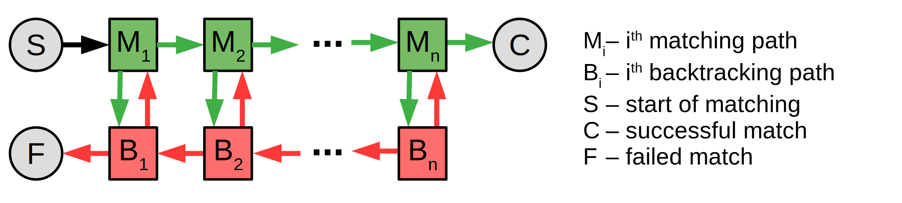

# Speeding Up PCRE2 With SLJIT

[PCRE2](https://www.pcre.org/) is a C library for matching regular expressions.
This library translates patterns into byte code, and this byte code can be executed by its interpreter.
The library also has a just-in-time (JIT) compiler which can produce machine code from the byte code to further improve the matching performance.
Before going into the details of the JIT compiler, the reason of choosing byte code as an internal representation is explained first.

Regular expressions were originally designed for defining a set of words using special patterns, and engines only needed to decide whether a given word is in the set.
Eventually patterns become a list of commands, and pattern matching engines become script languages.
Today many constructs of structured programming are available in regular expressions (pcre2pattern / perlre) such as loops (called repetitions), if-else selection (called conditional blocks), function calls (called recursions), returns and breaks (called control verbs).
The execution of each command is accurately defined which allows fine control over the entire matching process.
Patterns can also store information in local variables (called capturing blocks and marks) and these variables are often available after the matching is completed.
Byte code is used as an internal representation in many script languages, and modern regular expression engines are no different.
There are several methods to improve the performance of byte code execution (including JIT compiling), but even the fastest script language can do very little to improve the speed of a slow bubble sort.
Hence it is recommended to carefully design patterns to avoid slow matching speed.

## Structure of the Generated Code

Regular expression patterns are a sequence of sub-patterns which are matched in concatenation order.
When a sub-pattern matches successfully, the engine tries to match the next sub-pattern, and when its matching is failed, the engine falls back to the previous sub-pattern.
If the previous sub-pattern has multiple options for matching, and another option does match, the engine will try to match the next sub-pattern again.
This technique is called backtracking.

The code generated by PCRE2 JIT is specialized for this execution order.
For each sub-pattern the compiler generates two code paths called matching and backtracking path.
The order of matching paths in the generated code is the same as the original concatenation order since the next sub-pattern must be matched after a successful match.
However the backtracking paths are generated in a reversed concatenation order because the engine must fall back to the previous sub-pattern after a failed match.
Control flow is shown in the next figure where green and red arrows show the possible control transfers from matching and backtracking paths respectively.
Due to the code generation order described before, no jump instructions are needed for control transfers represented by horizontal arrows.



The next figure shows the structure of the machine code generated from the /a(?:\w\d)+d/ pattern:

```python

     # Start of matching paths
   ENTER
     # Matching path of matching the "a" letter
   MATCH "a", IF FAILS GOTO L6
     # Matching path of (?:)+
   STACK_PUSH NULL
L1:
     # Matching path of matching the \w special character
   MATCH WORD_CHARACTER, IF FAILS GOTO L5
     # Matching path of matching the \d special character
   MATCH DIGIT_CHARACTER, IF FAILS GOTO L4
     # Continue the matching path of (?:)+
   STACK_PUSH STRING_POINTER
   GOTO L1
L2:
     # Matching path of matching the "d" letter
   MATCH "d", IF FAILS GOTO L3
   RETURN SUCCESS

     # Start of backtracking paths
     # Backtracking path of matching the "d" letter (empty)
L3:
     # Backtracking path of (?:)+ (empty)
     # Backtracking path of matching the dot special character (empty)
L4:
     # Backtracking path of matching the "b" letter (empty)
L5:
     # Continue backtracking path of (?:)+
   STRING_POINTER = STACK_POP
   IF STRING_POINTER != NULL GOTO L2
     # Backtracking path of matching the "a" letter (empty)
L6:
   RETURN FAIL
```

When a matching path has only one alternative (e.g. matching the letter `a`), the backtracking path is often empty, i.e. no instructions are generated at all.
Some constructs may contain the code paths of other sub-patterns.
In our example above, the code paths of `\w\d` sub-pattern is nested into the code paths of `(?:)+`.
Furthermore the current position in the input is stored in the `STRING_POINTER` variable.
This variable must have the correct value when the execution enters into a matching path, but it is undefined for backtracking paths.
Hence the backtracking path must restore (or set) it before jumps to a matching path.
This restoration can be seen in the backtracking path of `(?:)+`.

More about this method can be found in this [research paper](https://dl.acm.org/doi/abs/10.1145/2544137.2544146).
In the followings some optimizations done by the compiler is shown.

## Single Character Repitition Optimizations

Sometimes multiple letters represent a single character, such as `sh` in English or `sch` in German.
These sequences cannot be broken into smaller parts, so perl calls them atomic blocks.
Another well known example is `\r\n` which represents a single newline.
Although `\r` and `\n` are also newlines, the `x\R{2}y` pattern does not match to `x\r\ny`, because there is only one newline between `x` and `y` letters.
Atomic blocks can speed up matching, since they can eliminate many retries.
For example `a+b` and `a++b` matches to the same strings since no `b` can be present in a sequence of `a`-s.
Hence the engine automatically converts the repetitions to the latter form whenever it has no side effects.

The JIT compiler can speed up repetitions followed by a single character as well.
An example is `\w+x`, where `\w+` cannot be converted to `\w++` because `x` is included in `\w` character class.
The code generated for `\w+` also records the first and last occurrence of `x` and backtracking is limited to this range.
This optimization has the highest efficiency when at most one `x` is found during the repetition.

The `(*SKIP)` control verb allows moving forward in the input.
For example, this verb can be used to search identifiers in a source code excluding comments and string literals.
To do that, the pattern should also look for comments and string literals but it skips these blocks instead of returning with a match.
Skip can be used to improve performance as well.
The `\w+!` and `\w+(*SKIP)!` patterns match to the same strings because when `\w+` is matched to a range of characters, but the match is failed afterwards, then any other match attempts within this range must fail as well.
Therefore the search can be resumed from the end of the range which eliminates several match attempts.
Besides adding `(*SKIP)` verbs to the pattern, the JIT compiler can also enhance iterators to remember the range of their last successful match, and any future matching attempts within this range triggers a fail.

## Character Class Optimizations

Checking that a character is in a set of characters (called character classes) is a frequent operation in pattern matching.
When caseless mode is enabled, even a simple pattern character may match to different characters especially when UTF is enabled.

The most basic optimization is caseless compare with a single compare instruction if there is only one bit difference between the binary representation of the lower and upper case of a character.
For example, ascii `x` and `X` differs only in bit 6, so `(chr|0x20)=='x'` performs a caseless compare, and it is faster than doing two compares.
This can be extended to ranges, so the `[f-xF-X]` range can be checked with this formula: `((chr|0x20)-'f')<('x'-'f')`.
Optimizing these cases is no different from optimizing conditional expressions in static compilers such as GCC.

The JIT compiler also has some UTF related optimizations.
For example, if a class is limited to characters less than 128 in UTF8 mode, reading only the next byte is enough and it is faster than decoding the UTF8 character.
This optimization is not limited to the previous case, the compiler can generate specialized readers which do not decode characters outside of a given range.
When invalid UTF8 parsing is enabled, the character reader first checks whether the input buffer has at least four remaining bytes.
This is nearly always true, and then the character can be decoded without further boundary checks since four is the size of the longest UTF8 character.

The JIT compiler generates helper functions for several operations, such as decoding complex UTF cases.
These functions are extremely lightweight: they don't set up a call frame or save any CPU registers, and can even modify the status of the caller.
The effect is quite similar to inlining, except that the function is actually called.
Must CPUs has return address predictors, so calling these functions are cheap operations.

## Literal Optimizations

Literals are fixed character sequences and they are often found in patterns.
Comparing them to the input is a frequent task which normally requires the same number of steps as the length of the literal.
However CPU registers are often large enough to hold multiple characters so the number of comparisons can be reduced as long as the CPU can read a whole register from any starting address.
Such read is called unaligned access and requires hardware support.

Single Instruction Multiple Data (SIMD) operations can speed up literal searching.
These operations can process the input efficiently since they use large registers which can hold several input characters.
The JIT compiler uses SIMD for searching characters and character pairs.
Searching a pair is based on an observation that the chance of finding a pair is often much lower than finding a single character.
The only condition is that the two characters of a pair must be different since searching two spaces instead of one might not give better results.
The compiler tries to detect the pair with the lowest match probability, so it will choose the `a` and `c` characters from the `a.(?i:b).c` pattern.

## Summary

PCRE2 is among the most feature rich regular expression libraries.
It supports many regular expression constructs and it has many operating modes.
Its JIT compiler tries to optimize many of these features with static compiler optimizations, and this text introduces some of these optimizations.
Besides these optimizations, directed pattern transformations can also help to improve performance, but that is the focus of other projects such as [repan](https://github.com/zherczeg/repan).
